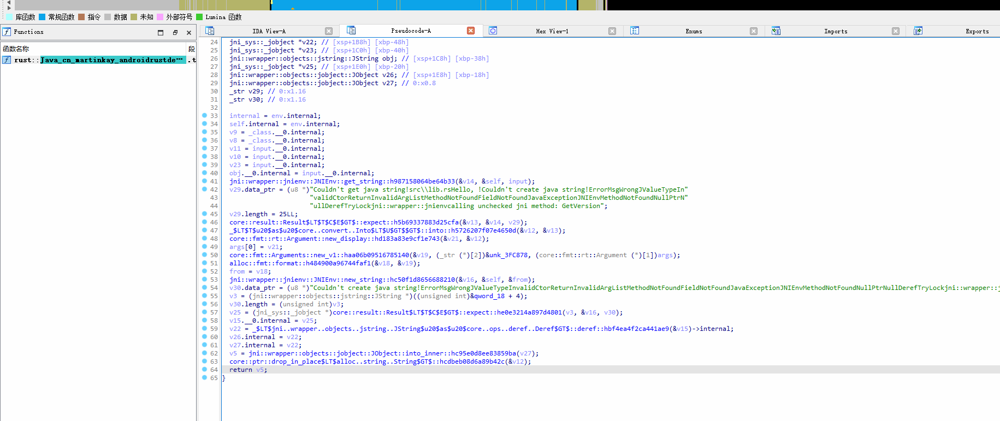
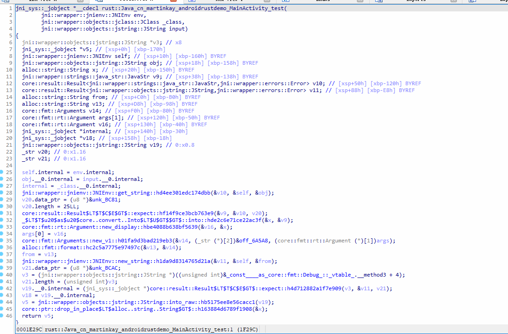

# 几个使用的问题点

在你没创建项目前就需要使用
```groovy
cargo {
    module = "../rust"       // Or whatever directory contains your Cargo.toml
    libname = "rust"          // Or whatever matches Cargo.toml's [package] name.
    targets = listOf("arm", "arm64", "x86")  // See bellow for a longer list of options
}
```

创建rust项目可以在根目录下进行创建，使用RustRover直接创建即可。
路径与module对应即可
```groovy
cargo {
    module = "../rust"
}
```

如果出现找不到so的问题，你需要使用这段代码
```groovy
tasks.matching { it.name.matches(Regex("merge.*JniLibFolders")) }.configureEach {
    inputs.dir(File(buildDir, "rustJniLibs/android"))
    dependsOn("cargoBuild")
}
```
- tasks.matching 查找所有名称匹配 merge.*JniLibFolders 的任务（通常是 Android 的 mergeXXXJniLibFolders 任务，负责合并 JNI 库）。  
  - 使用正则表达式 Regex("merge.*JniLibFolders") 匹配任务名。  
-  .configureEach { ... } 对匹配到的每个任务进行配置。  
- inputs.dir(File(buildDir, "rustJniLibs/android")) 声明任务的输入目录为 buildDir/rustJniLibs/android，确保 Gradle 能检测该目录的变化，并在必要时重新运行任务（增量构建）。  
- dependsOn("cargoBuild") 让这些 merge...JniLibFolders 任务依赖于 cargoBuild 任务（通常是 Rust/Cargo 编译 JNI 库的任务），确保 Rust 代码先编译，再合并到 APK。  


jni版本在0.5.3版本编译(带符号)示例代码后的arm64库文件大小高达15MB  
在换到0.21.1版本后编译(带符号)的大小在6MB左右  

不同jni版本的写法均不一致，请注意参考  
https://docs.rs/jni/0.5.3/jni/index.html  
https://docs.rs/jni/0.21.1/jni/index.html  

在0.5.3版本中的  
env: JNIEnv是不需要增加mut关键字的，而在0.21.1中是需要mut env: JNIEnv  

在0.5.3版本中的env.get_string(input)传入的是input: JString  
而在0.21.1版本中你需要使用env.get_string(&input)  

在0.5.3版本中使用output.into_inner()  
在0.21.1版本中使用output.into_raw()  

编译后的代码反编译的伪代码  
0.5.3版本如下所示  
  

0.21.1版本如下所示  
  

在发布生产版本时，请注意将profile改为release，此时编译的文件会去除符号。大小约在360kb。
```groovy
cargo {
    profile = "release" // Or "debug" if you want to debug your Rust code
}
```
  
